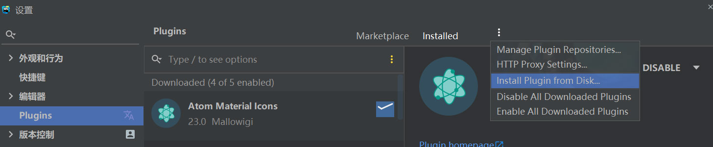

# WebStorm 配置

## 获取许可证

[使用开源项目免费申请 JetBrains 全家桶开源许可证](https://www.jetbrains.com/shop/eform/opensource)

## 汉化

- 方案一
  - 进入 `文件 - 设置 - Plugins - Marketplace`
  - 搜索 `Chinese ​(Simplified)​ Language Pack EAP` 下载安装
- 方案二
  - 打开 [Chinese ​(Simplified)​ Language Pack EAP](https://plugins.jetbrains.com/plugin/13710-chinese-simplified-language-pack-eap)
  - 点击 `Install to IDE` 按钮再选择对应编辑器
- 方案三
  - 查看本地 `WebStorm` 版本
    - 进入 `帮助 - 关于`
    - 找到 `Build #WS-` 后面的数字
  - 打开 [Chinese ​(Simplified)​ Language Pack EAP](https://plugins.jetbrains.com/plugin/13710-chinese-simplified-language-pack-eap)
  - 点击 `Versions` 选择对应编辑器再搜索对应版本下载（当找不到一样的版本时，可以看列表的第二栏版本范围，找包含你编辑器的版本下载就行）
  - 通过磁盘安装刚下载的文件

## 编辑器美化

- 主题（进入 `文件 - 设置 - Plugins - Marketplace` 安装如下插件）
  - [Atom Material Icons](https://plugins.jetbrains.com/plugin/10044-atom-material-icons/) 图标美化
  - [Atom OneDark Theme](https://plugins.jetbrains.com/plugin/12178-atom-onedark-theme) Atom OneDark 主题
  - [Material Theme UI](https://plugins.jetbrains.com/plugin/8006-material-theme-ui) Material Design 主题
  - [One Dark theme](https://plugins.jetbrains.com/plugin/index?xmlId=com.markskelton.one-dark-theme) 黑色主题
- 配色方案
  - [bluloco 方案](https://github.com/uloco/webstorm-bluloco-scheme)
    - [Dark 下载](https://cdn.jsdelivr.net/gh/uloco/webstorm-bluloco-scheme/Bluloco%20Dark.icls)
    - [Light 下载](https://cdn.jsdelivr.net/gh/uloco/webstorm-bluloco-scheme/Bluloco%20Light.icls)
- 自定义背景图
  - 进入 `文件 - 设置 - 外观和行为 - Appearance`
  - 点击 `BACKGROUND IMAGE`
- 其他
  - [.env files support](https://plugins.jetbrains.com/plugin/9525--env-files-support) `.env` 文件键值字符串高亮

## 插件市场

- [官方](https://plugins.jetbrains.com/)

## 保存格式化

1. 进入 `文件 - 设置 - 工具 - File Watchers`
2. 点击 `+` 选择 `Prettier`
3. 将 `File type` 修改为你需要的文件类型，通用可选 `Any`

## webpack 项目识别 alias

1. 进入 `文件 - 设置 - 框架和语言 - JavaScript - Webpack`
2. 将 webpack 配置文件地址修改为对应地址
   1. vue-cli2: 项目地址 + `\build\webpack.base.conf.js`
   2. vue-cli3: 项目地址 + `\node_modules\@vue\cli-service\webpack.config.js`
